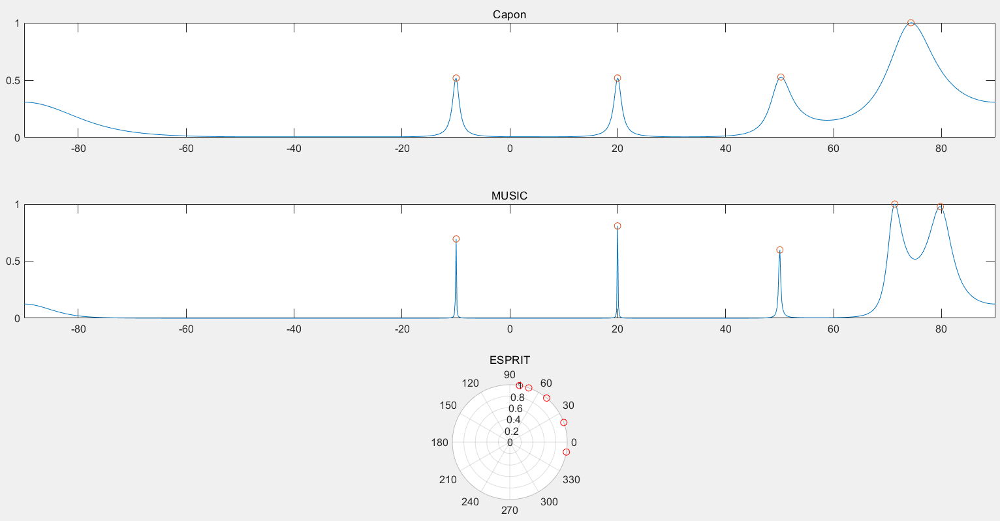
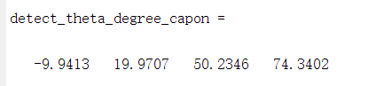
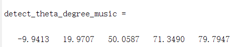
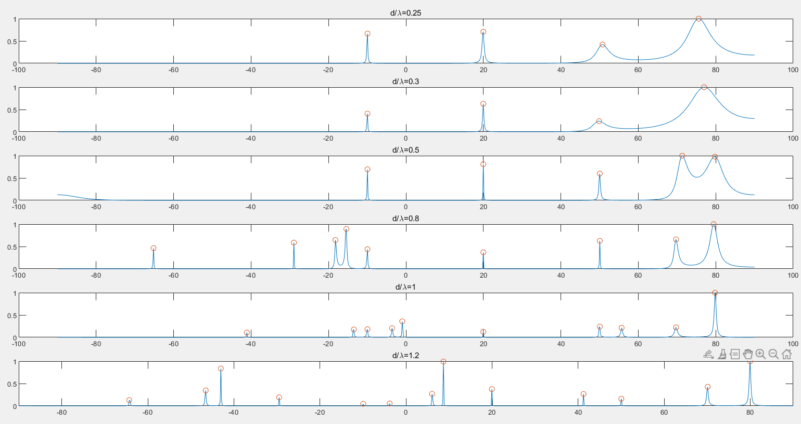
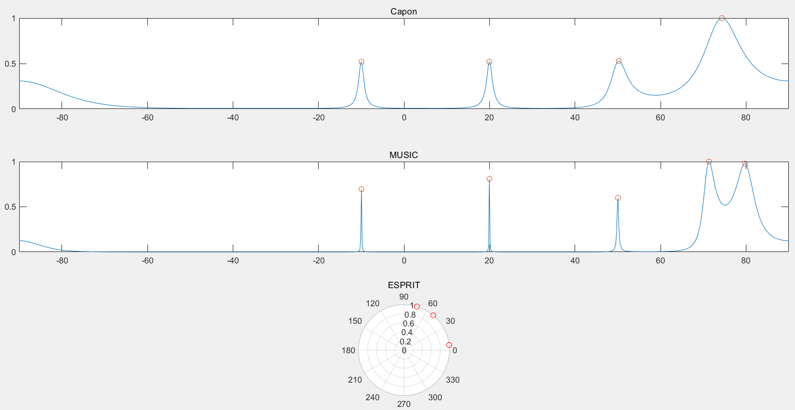
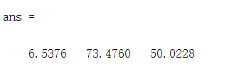

# DOA估计算法

---

## 算法调研

DOA 常用算法包括 Capon、MUSIC、ESPRIT 算法等。

### Capon 算法

Capon 算法本质上是一个优化问题：
$$
\min\limits_{w} w^HR_xw \\
s.t.\quad w^Ha(\theta)=1
$$
具体求解过程略过，最后求解结果为：
$$
\hat{w}=\frac{R_x^{-1}a(\theta)}{a^H(\theta)R_x^{-1}a(\theta)}
$$
代入求解得功率随 $\theta$ 分布如下：
$$
P_{Capon}(\theta)=\frac{1}{a^H(\theta)R_x^{-1}a(\theta)}
$$
故只需计算出 $P_{Capon}(\theta)$，搜索得到其峰值点位置，即可得到 $\theta$ 估计值。

### MUSIC 算法

相比于直接使用观测数据的协方差阵 $R_x$，MUSIC 算法先对 $R_x$ 作特征分解，选取出噪声信号对应分量，再计算功率进行估计。具体算法流程如下：

首先对 $R_x$ 进行特征分解，分解为信号 s 分量与噪声 n 分量：
$$
R_x=U_s\Sigma_sU_s^H+U_n\Sigma_nU_n^H
$$
选取部分分量为噪声分量，一般选取特征值最小的几个分量作为 $U_n$，

经过推导，得到 MUSIC 算法下的功率 $P_{MUSIC}(\theta)$，为：
$$
P_{MUSIC}(\theta)=\frac{1}{a^H(\theta)U_nU_n^Ha(\theta)}
$$
然后可以搜索出 $P_{MUSIC}(\theta)$ 峰值点位置，得到 $\theta$ 的估计值。

### ESPRIT 算法

ESPRIT 算法与前二者都不同，该算法并不通过搜索功率谱来得到 $\theta$ 的估计值，而是通过求解算法所假设的旋转矩阵 $\Psi$，来估计 $\theta$。旋转矩阵的假定如下：
$$
x = As + w \\
y = A\Psi s + w \\
y(n) = x(n + 1)
$$
ESPRIT 算法与前二者的另一点不同，是该算法需要提前预估信号源的个数，才能正常工作。

具体算法流程如下：

对观测数据的协方差阵 $R_{x}$ 作 SVD 分解，得到旋转矩阵 U 和奇异值矩阵 D
$$
U, D, V = SVD(R_x)
$$
取出 $R_x$ 最大的 $k$ 个奇异值（即 U 的最大 $k$ 个特征值）对应的 U 矩阵的分量，并可以计算旋转前后的信号 x, y 对应的信号矩阵，其中 y 是 x 的信号部分旋转后得到的：

~~~matlab
Us = U(:, 1: src_num);
Usx = Us(1: M - 1,:); 
Usy = Us(2: M,:);
~~~

由于
$$
U_{sy} = \Psi U_{sx}
$$
这样就可以解出 $\Psi$。

由于理论上 $\Psi$ 是 $e^{-jw_k}$ 组成的对角矩阵（当 y(n) = x(n + 1) 时），故可求出 $\Psi$ 所有特征值，求相角得到 $w_k$，进而通过公式
$$
w_k=\frac{2\pi dsin(\theta_k)}{\lambda}
$$
算出 $\theta_k$ 。

## 信号生成

生成导向矢量对应的矩阵 $A$

~~~matlab
dist = 0.3;
M = 10;
lambda = c / f0;
A = exp([0: 1: M - 1]' * 2 * pi * dist / lambda * sin(theta) * -1j);
~~~

生成信号 $s$

~~~matlab
f = [1, 3, 5, 6, 7] * 1e6;
s = exp(2 * pi * f' * 1j * t);
~~~

生成复高斯白噪声 $n$

~~~matlab
snr = 12;
gm = gmdistribution(0, 1 / db2pow(snr));
gwn = zeros(M, N);
for i = 1: 1: M
    gwn(i, :) = random(gm, N)' + 1j * random(gm, N)';
end
~~~

根据公式
$$
x=As+n
$$
可以生成出接收信号 $x$。

## 算法结果

分别运行 Capon 算法、MUSIC 算法、ESPRIT 算法，放在一张图上观察，结果如下：

Capon 算法和 MUSIC 算法都是通过搜索功率谱找峰值点进行估计，ESPRIT 算法则是直接给出源角度估计。

可以看到，Capon 算法无法很好的区分 70° 和 80° 的波束方向，其具体结果如下：

MUSIC 算法成功将所有角度都识别出来了，其具体结果如下：

非常接近真值，误差较小。

ESPRIT 算法在提前预知有 5 个源波方向的前提下，也能够很好地将角度预测出来，具体结果如下：

## 调整 $\frac{d}{\lambda}$，观察 MUSIC 算法性能

调整 $\frac{d}{\lambda}$ 为 0.25、0.3、0.8、1、1.2，并与 0.5 作对比，结果如下：

第三幅图为 0.5 时的情况。

可以看到，当 $\frac{d}{\lambda}$ 较小时，70° 和 80° 发生混叠，MUSIC 算法不能很好地分离他们。

但当 $\frac{d}{\lambda}$ 较大时，会检测到其他角度上也有峰值，结果较差。

因此，MUSIC 算法 $\frac{d}{\lambda}$ 过大或过小时，算法性能都会有所下降。

## 改变信源数目，重新估计

在我的实现中，Capon 算法只用 $R_x$，MUSIC 算法恒取最小的 2 个特征值分量作为噪声分量，因此只有 Esprit 算法会受到先验的信源数目的影响。

改变先验的信源数目为 3，重新进行估计，结果如下：

只有 ESPRIT 算法受到影响，只能识别出三个角度，具体值如下：

检测结果并不好。可见 ESPRIT 算法极其依赖预估的信源数目。

## 文件说明

所有代码文件位于 `src/` 下，其中 `Problem1.m, Problem2.m, Problem3.m` 分别对应大作业说明书中的第 3, 4, 5 题。

